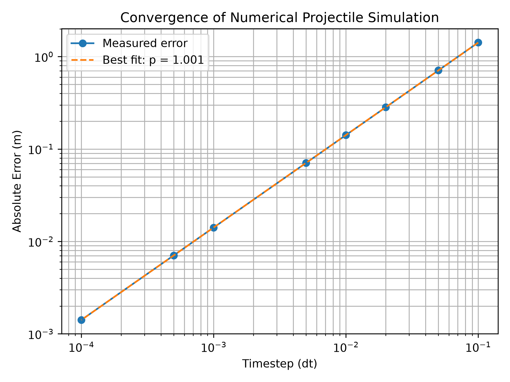
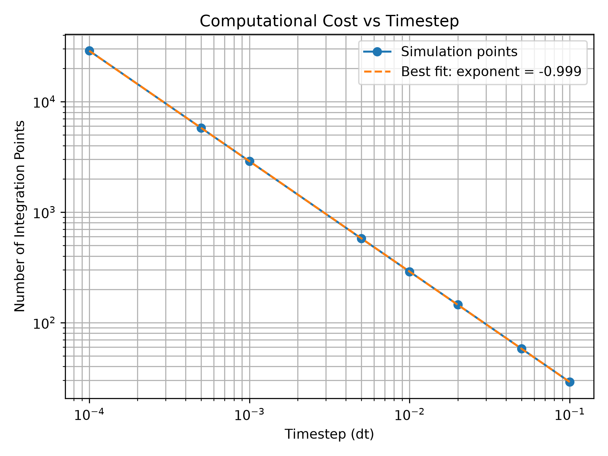
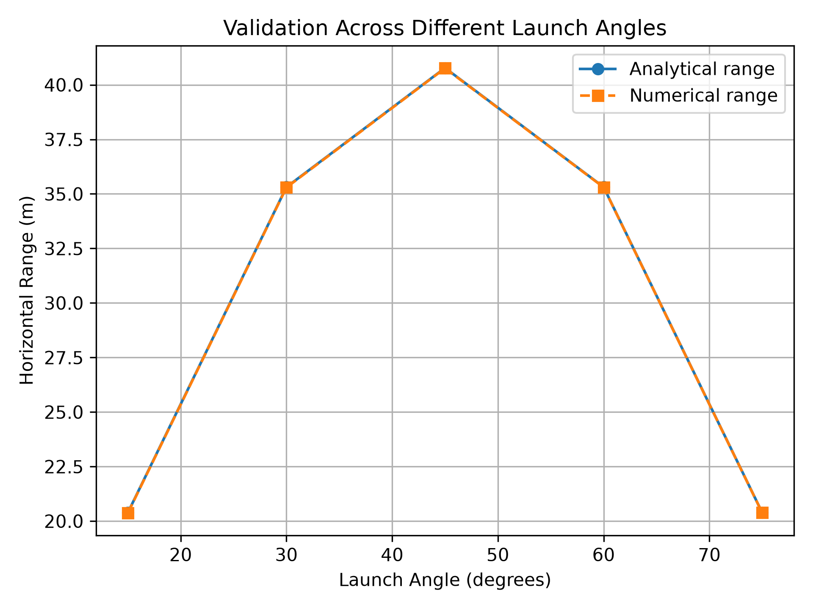

# Projectile-motion-visualiser
# Projectile Motion: Numerical Simulation and Analysis

A Python-based computational investigation of projectile motion, combining an interactive visualiser with numerical analysis of timestep accuracy, convergence, computational cost, and model validation.

## Overview

This project began as an interactive 2D projectile-motion visualiser and was extended into a numerical investigation of how a simple time-stepping simulation behaves as the timestep is changed.

The main question investigated was:

> **How does timestep size affect the accuracy and computational cost of a numerical projectile-motion simulation?**

The numerical results are compared against the analytical solution for ideal projectile motion. The project also tests the numerical method across multiple launch angles.

## Features

* Interactive 2D projectile trajectory visualisation
* Adjustable initial velocity and launch angle
* Numerical time-stepping simulation
* Linear interpolation at ground crossing
* Analytical calculation of projectile range
* Convergence analysis across multiple timestep sizes
* Computational-cost analysis
* Validation across different launch angles
* Automatic generation of figures and CSV results

## Physics Model

The simulation assumes ideal projectile motion:

* No air resistance
* Constant gravitational acceleration
* Flat ground
* Constant horizontal velocity
* Uniform gravitational acceleration

For an initial velocity \(v_0\) and launch angle \(\theta\), the theoretical horizontal range is

$$
R = \frac{v_0^2\sin(2\theta)}{g}
$$

where \(g = 9.81\,\text{m/s}^2\).

This analytical result provides a reference against which the numerical simulation can be evaluated.

## Numerical Method

The simulation advances the projectile in small timesteps.

At each timestep:

1. The vertical velocity is updated using gravitational acceleration.
2. The horizontal and vertical positions are updated.
3. The simulation checks whether the projectile has crossed the ground.
4. When the trajectory crosses \(y=0\), linear interpolation between the final two points estimates the landing position.

The interpolation step reduces the error caused by stopping only after the projectile has already moved below the ground.

## Numerical Investigation

### 1. Convergence Analysis

The simulation was run using timestep sizes ranging from:

0.1
0.05
0.02
0.01
0.005
0.001
0.0005
0.0001

For the main experiment:

Initial velocity = 20 m/s
Launch angle     = 45°
Gravity          = 9.81 m/s²

The analytical range is:

40.7747196738 m

The numerical results showed that reducing the timestep progressively reduced the error.

| Timestep | Numerical Range (m) | Absolute Error (m) |
| -------: | ------------------: | -----------------: |
|      0.1 |       39.3532329284 |       1.4214867454 |
|     0.05 |       40.0648132385 |       0.7099064353 |
|     0.02 |       40.4916121406 |       0.2831075332 |
|     0.01 |       40.6331912041 |       0.1415284697 |
|    0.005 |       40.7039807358 |       0.0707389380 |
|    0.001 |       40.7605767298 |       0.0141429440 |
|   0.0005 |       40.7676483080 |       0.0070713658 |
|   0.0001 |       40.7733054566 |       0.0014142172 |

The log-log relationship between timestep and error provides an estimate of the numerical convergence rate.

The important observation is that **smaller timesteps improve accuracy, but they also require more integration steps**.

### 2. Computational Cost

The number of integration points was recorded for every timestep.

As the timestep becomes smaller, the simulation requires substantially more points to represent the same physical trajectory.

This illustrates an important numerical-computing trade-off:

> **Higher numerical accuracy comes at the cost of increased computation.**

A timestep that is unnecessarily small can provide very little additional accuracy relative to the computational work required.

### 3. Validation Across Launch Angles

The numerical method was also tested at several launch angles:

15°
30°
45°
60°
75°

The numerical ranges were compared with the analytical solution for each angle.

The results reproduce the expected symmetry of ideal projectile motion:

* 15° and 75° produce approximately equal ranges.
* 30° and 60° produce approximately equal ranges.
* The maximum theoretical range occurs at 45°.

This provides an additional check that the numerical implementation behaves consistently beyond a single test case.

## Key Findings

The investigation produced three main observations:

1. **Reducing the timestep reduces numerical error.**
2. **Reducing the timestep increases computational work.**
3. **The numerical model reproduces the expected dependence of projectile range on launch angle.**

The project therefore demonstrates a basic but important idea in computational science: **numerical accuracy and computational efficiency must be considered together.**

## Project Structure

Projectile-motion-visualiser/
│
├── projectile.py
│   └── Interactive projectile visualiser
│
├── projectile_analysis.py
│   └── Numerical experiments and analysis
│
├── convergence.png
│   └── Timestep convergence plot
│
├── computational_cost.png
│   └── Computational-cost analysis
│
├── validation.png
│   └── Analytical vs numerical validation
│
├── results.csv
│   └── Numerical experiment results
│
├── .gitignore
└── README.md

## Requirements

* Python 3
* NumPy
* Matplotlib

Install the dependencies with:

pip install numpy matplotlib

## Running the Interactive Visualiser

Run:

python projectile.py

The visualiser allows the initial velocity and launch angle to be changed interactively.

## Running the Numerical Analysis

Run:

python projectile_analysis.py

The analysis script:

* runs the simulation for multiple timestep sizes,
* calculates the error relative to the analytical solution,
* estimates convergence behaviour,
* measures computational cost,
* validates the method across launch angles,
* saves the generated figures,
* and writes the numerical results to CSV.

## Limitations

This project uses an idealised projectile-motion model.

It does not currently account for:

* Air resistance
* Wind
* Variable gravitational acceleration
* Three-dimensional motion
* Non-flat terrain
* Rotational effects

These assumptions make the system simple enough to analyse while providing a useful setting for studying numerical methods.

## What I Learned

This project helped me explore the difference between obtaining a numerical result and understanding how reliable that result is.

The most interesting part of the investigation was the relationship between timestep size, accuracy, and computational cost. Changing a numerical parameter can improve the result, but it can also substantially increase the amount of computation required.

This introduced me to a broader idea in computational problem solving: **a good numerical method is not only about getting an accurate answer, but also about understanding the cost of obtaining it.**

## Future Extensions

Possible extensions include:

* Adding air resistance
* Comparing different numerical integration methods
* Investigating adaptive timestep selection
* Measuring runtime in addition to integration-point count
* Extending the model to two- or three-dimensional motion

## Author

**Faris Zahidi**

Independent computational project exploring numerical simulation, physics, and programming.

